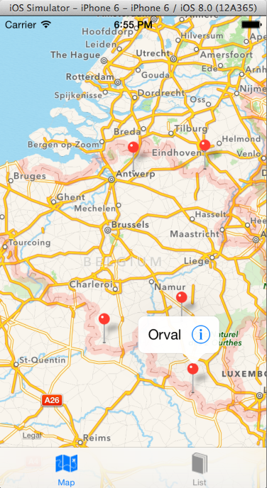

# Beers.app #

This example shows how to create an app that contains two tabs. The
first tab is a map with custom created pins that are postioned at a
specific latitude longitude location. The second tab shows a list
view. The entry point for an iOS application is
`app_delegate.rb`. Start there and read to code and comments.



The icon files in the resources directory are from the [Glyphish project](http://glyphish.com).

# Join the RubyMotion Slack Channel #

[Here is the link.](http://motioneers.herokuapp.com/) Say hello!

# Minimum Requirements #

The minimum requirements to use this template are XCode 9.2 and
RubyMotion 5.0.

Keep in mind that if you've recently upgraded from a previous versions
of XCode or RubyMotion, you'll want to run `rake clean:all` as opposed
to just `rake clean`.

# Build #

To build using the default simulator, run: `rake` (alias `rake
simulator`).

To run on a specific type of simulator. You can run `rake simulator
device_name="SIMULATOR"`. Here is a list of simulators available:

- `rake simulator device_name='iPhone 5s'`
- `rake simulator device_name='iPhone 8 Plus'`
- `rake simulator device_name='iPhone 8 Plus'`
- `rake simulator device_name='iPhone X'`
- `rake simulator device_name='iPad Pro (9.7-inch)'`
- `rake simulator device_name='iPad Pro (10.5-inch)'`
- `rake simulator device_name='iPad Pro (12.9-inch)'`

Consider using https://github.com/KrauseFx/xcode-install (and other
parts of FastLane) to streamline management of simulators,
certificates, and pretty much everything else.

So, for example, you can run `rake simulator device_name='iPhone X'`
to see what your app would look like on iPhone X.

# Deploying to the App Store #

To deploy to the App Store, you'll want to use `rake clean
archive:distribution`. With a valid distribution certificate.

In your `Rakefile`, set the following values:

```ruby
#This is only an example, the location where you store your provisioning profiles is at your discretion.
app.codesign_certificate = "iPhone Distribution: xxxxx" #This is only an example, you certificate name may be different.

#This is only an example, the location where you store your provisioning profiles is at your discretion.
app.provisioning_profile = './profiles/distribution.mobileprovision'
```

For TestFlight builds, you'll need to include the following line
(still using the distribution certificates):

```ruby
app.entitlements['beta-reports-active'] = true
```

# Icons #

As of iOS 11, Apple requires the use of Asset Catalogs for defining
icons and launch screens. You'll find icon and launch screen templates
under `./resources/Assets.xcassets`. You can run the following script
to generate all the icon sizes (once you've specified `1024x1024.png`).
Keep in mind that your `.png` files _cannot_ contain alpha channels.

Save this following script to `./gen-icons.sh` and run it:

```sh
set -x

brew install imagemagick

pushd resources/Assets.xcassets/AppIcon.appiconset/

cp 1024x1024.png "20x20@2x.png"
cp 1024x1024.png "20x20@3x.png"
cp 1024x1024.png "29x29@2x.png"
cp 1024x1024.png "29x29@3x.png"
cp 1024x1024.png "40x40@2x.png"
cp 1024x1024.png "40x40@3x.png"
cp 1024x1024.png "60x60@2x.png"
cp 1024x1024.png "60x60@3x.png"
cp 1024x1024.png "20x20~ipad.png"
cp 1024x1024.png "20x20~ipad@2x.png"
cp 1024x1024.png "29x29~ipad.png"
cp 1024x1024.png "29x29~ipad@2x.png"
cp 1024x1024.png "40x40~ipad.png"
cp 1024x1024.png "40x40~ipad@2x.png"
cp 1024x1024.png "76x76~ipad.png"
cp 1024x1024.png "76x76~ipad@2x.png"
cp 1024x1024.png "83.5x83.5~ipad@2x.png"

mogrify -resize 40x40 "20x20@2x.png"
mogrify -resize 60x60 "20x20@3x.png"
mogrify -resize 58x58 "29x29@2x.png"
mogrify -resize 87x87 "29x29@3x.png"
mogrify -resize 80x80 "40x40@2x.png"
mogrify -resize 120x120 "40x40@3x.png"
mogrify -resize 120x120 "60x60@2x.png"
mogrify -resize 180x180 "60x60@3x.png"
mogrify -resize 20x20 "20x20~ipad.png"
mogrify -resize 40x40 "20x20~ipad@2x.png"
mogrify -resize 29x29 "29x29~ipad.png"
mogrify -resize 58x58 "29x29~ipad@2x.png"
mogrify -resize 40x40 "40x40~ipad.png"
mogrify -resize 80x80 "40x40~ipad@2x.png"
mogrify -resize 76x76 "76x76~ipad.png"
mogrify -resize 152x152 "76x76~ipad@2x.png"
mogrify -resize 167x167 "83.5x83.5~ipad@2x.png"

popd
```

For more information about Asset Catalogs, refer to this link: https://developer.apple.com/library/content/documentation/Xcode/Reference/xcode_ref-Asset_Catalog_Format/
